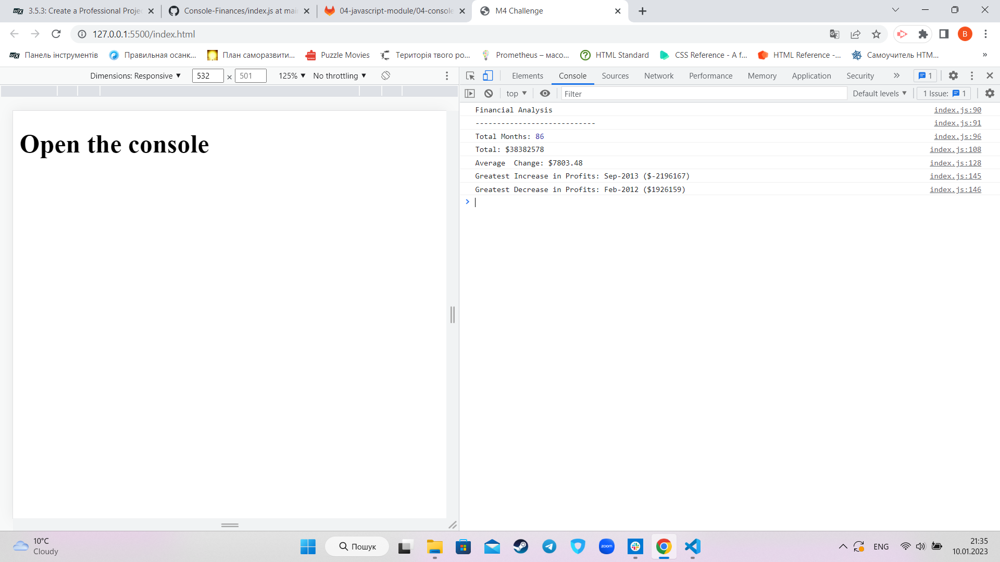

# <Console-Finaces>

## Description
This project's taks was to work with financial report ( array) and 
find out how to make calculations in an array.
My report shows the key points of the financial report such as:
- The total number of months included in the dataset;
- The net total amount of Profit/Losses over the entire period;
- The average of the changes in Profit/Losses over the entire period;
- The greatest increase in profits and the greatest decrease in losses.
- What did you learn?

## Installation

N/A

## Usage

In order to see the report follow the link and open the console in your browser.
https://hllmtrxwrld.github.io/Console-Finances/

## Credits

N/A

## License

N/A
